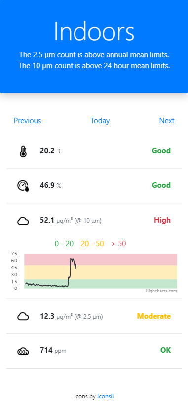

# Raspberry Pi House Sensor

- A web application hosted on a Raspberry Pi and accessable over LAN.
- The web application logs readings from sensors connected to the Pi.
- The web application allows you to view the data by day.

## Features
- Live view of data readings.
- Toggleable charts.
- Daily view of data.
- View previous days.
- Summary text for the live readings.

## Sensors
- Temperature _(DHT22)_
- Humidity _(DHT22)_
- 2.5 μm particles _(SDS011)_
- 10 μm particles _(SDS011)_
- CO2 count _(MH-Z19B)_

## Possible future work
- Multiple rooms with one Pi hosting the application & data, and other devices sending data readings.
- Configure which sensors are attached.
- Configure sensor limits through the UI.